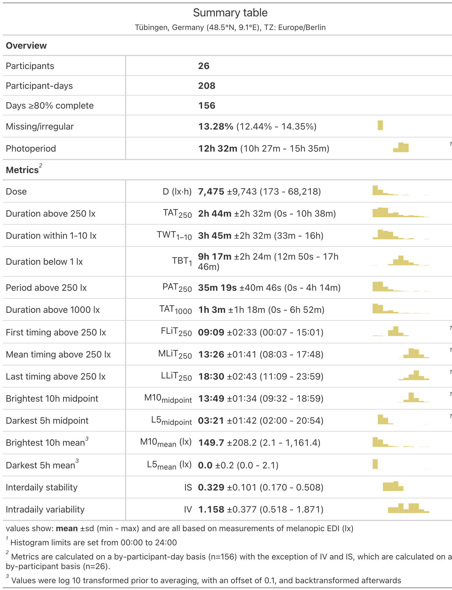
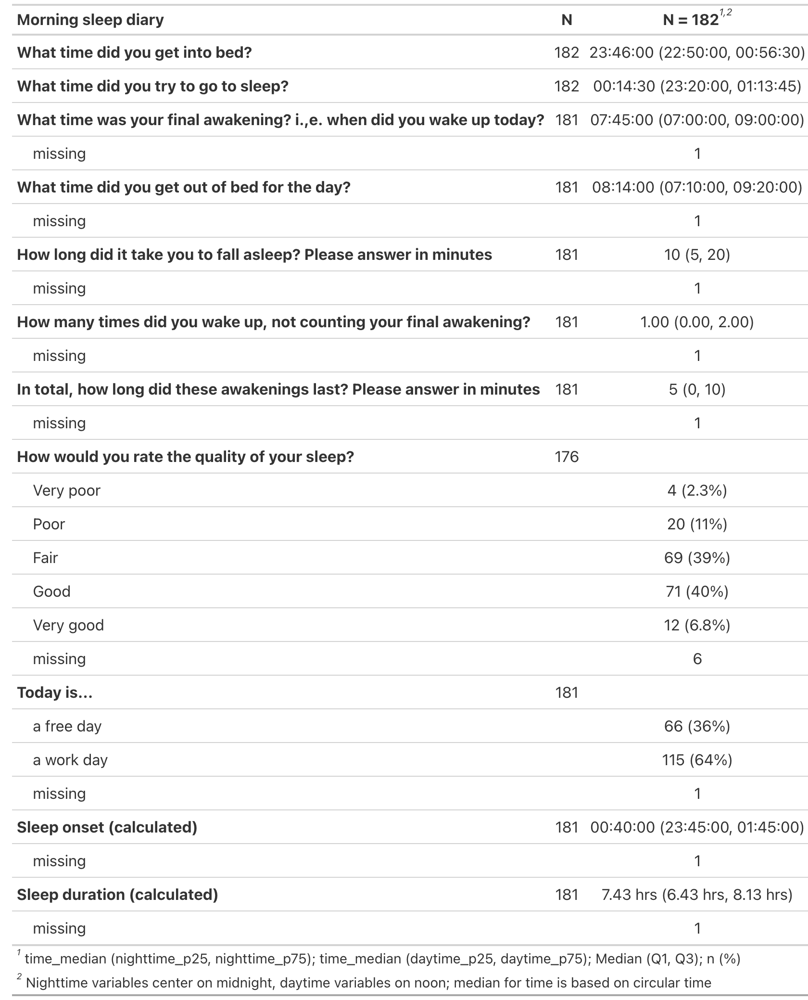

<!-- README.md is generated from README.Rmd. Please edit that file -->

```{r, include = FALSE}
knitr::opts_chunk$set(
  collapse = TRUE,
  comment = "#>"
)
```

   
   


### Personal light exposure dataset for Tuebingen, Germany; collected by Max Planck Institute for Biological Cybernetics (MPI KYB) and used to model the protocol of Guidolin et al. 2024 (MeLiDos field study)

**Version v1.0.0**

<!-- badges: start -->
[](https://doi.org/10.5281/zenodo.16895188)
<!-- badges: end -->


### About this repository

This repository contains the comprehensive dataset for the field study site of Tuebingen, Germany. Data were collected by the [Max Planck Institute for Biological Cybernetics (MPI KYB)](https://www.kyb.tuebingen.mpg.de/en) and are further processed and analysed by the [Translational Sensory & Circadian Neuroscience Unit (TSCN)](https://www.tscnlab.org). This dataset precedes the [MeLiDos](www.melidos.eu) protocol [Guidolin et al., 2024](https://www.ncbi.nlm.nih.gov/pubmed/39592960) and was partly used to shape the protocol. Thus, while the data in this repository share many similarities with other datasets published after [Guidolin et al., 2024](https://www.ncbi.nlm.nih.gov/pubmed/39592960), some differences remain. A detailed description of the data is available in the [legacy dataset repository](https://github.com/tscnlab/GuidolinEtAl_Dataset_2025).

This repository is transitioning towards a [FAIR](https://www.go-fair.org/fair-principles/) and fully human and machine-readable light exposure dataset, based on a [community-based and peer-reviewed Metadata descriptor](https://bmcdigitalhealth.biomedcentral.com/articles/10.1186/s44247-024-00113-9). As part of this transition, files will be converted from semi-rectangular data, to fully [tabular data](https://specs.frictionlessdata.io/tabular-data-package/). Further, metadata will be added and converted from XLSX to JSON. For full traceability, all versions will be archived in [Zenodo](https://zenodo.org) and are accessible through their own persistent identifier (DOI).

### Citation

APA reference:

> Guidolin, C., Zauner, J., & Spitschan, M.,  (2025). Personal light exposure dataset for Tuebingen, Germany (Version 1.0.0) [Data set]. URL: https://github.com/MeLiDosProject/GuidolinEtAl_Dataset_2025. DOI: doi.org/10.5281/zenodo.16895188

## Summary of the dataset
| Dataset name | cyepi |
| --- | --- |
| Period of data collection (total) | August 2023 to November 2023 |
| Location | Tuebingen, Germany |
| Number of participants enrolled  | N=30 |
| Number of participants included in data analysis and this repository | N=26 |
| Duration of experiment for each participant | N=7 days (Monday to Monday) |

### Included files

The following files are included with this Dataset:

- `data/Metadata_Melidos_TUM.xlsx`: Preliminary Metadata prior to conversion to JSON
<!-- - `data/Study_dates_MeLiDos_FUSPCEU.xlsx`: Recruitment dates to clean light exposure recordings -->

- `data`: Folder with measurement and project data in the following structure:
```         
    data/
        raw/
            group/
               actlumus/
               acttrust/
               chronotype/
               demographics/
               discharge/
               sleepdiary/
               wearlog/
            individual/
               $ParticipantID/
                     chronotype/
                     continuous/
                         actlumus/
                         acttrust/
                         currentconditions/
                         exercisediary/
                         experiencelog/
                         mHLEA_digital/
                         mHLEA_paper/
                         sleepdiary/
                         wearlog/
                         wellbeingdiary/
                     demographics/
                     discharge/
```

- `LICENSE`: Licensing terms. This dataset is published with a
  permissive CC-BY-4.0 license

All data are anonymous.

# Descriptive statistics

## Light



## Sleep



# Folder structure

## Group

This folder contains grouped data, i.e. any data that are collected at the group level and/or were grouped to facilitate import during analyses.

| Folder name | Content |
| --- | --- |
| **actlumus** | N=26 files from ActLumus, one for each participant |
| **acttrust** | N=26 files from ActTrust2, one for each participant |
| **chronotype** | N=2 csv files, one for the Morning Eveningness Questionnaire (MEQ) and one for the Munich Chronotype Questionnaire (MCTQ). Each contains data for N=26 participants.  |
| **demographics** | N=2 csv files. “201_231_demog_20231123.csv” contains only demographic information for N=26 participants. “201_231_demog_health_20231123.csv” contains both demographic as well as health information for N=26 participants. |
| **discharge** | N=1 csv file, which contains answers from all N=5 questionnaires that N=26 participants had to fill at discharge: 1) Light Exposure Behaviour Assessment (LEBA instrument), 2) Visual Light Sensitivity Questionnaire-8 (VLSQ-8), 3) Assessment of Sleep Environment (ASE) questionnaire, 4) Modified Theory Framework of Acceptability (mTFA) questionnaire, 5) Feedback (1 Y/N and 6 multiple choice questions). |
| **sleepdiary** | N=26 csv files, each corresponding to the sleep diary of an individual participant.  |
| **wearlog** | N=26 csv files, each corresponding to the wear log participants filled multiple times/day. |

## Individual

This folder contains individual-level data for N=26 participant, each stored in a separate folder named after the participant ID (PID). Furthermore, it also contains a folder where the ActLumus files for the environmental light light logger (named “ambient”) are stored. The data within each participant folder follows the following structure. 

| Folder name | Filename (sample) | Description and time of completion | Notes |
| --- | -- | ------ | --- |
|**chronotype/** | PID_mctq_yyyymmdd.csv | Munich Chronotype Questionnaire (MCTQ) completed at study intake (Monday, day 1) |  |
| **chronotype/** | PID_meq_yyyymmdd.csv | Morning Eveningness Questionnaire (MEQ) completed at study intake (Monday, day 1) |  |
| **continuous/actlumus/** | PID_actlumus_Log_automatedtimestamp.txt | ActLumus data, collected continuously (every 10 seconds) over the 8 days |  |
| **continuous/actlumus/** | PID_actlumus_Log_automatedtimestamp_Report.txt | N/A. This is a automated report which is saved with the actual data.  |  |
| **continuous/acttrust/** | PID_acttrust_Log_automatedtimestamp.txt | ActTrust2 data, collected continuously (every 60 seconds) over the 8 days |  |
| **continuous/acttrust/** | PID_actlumus_Log_automatedtimestamp_Report.txt | N/A. This is a automated report which is saved with the actual data.  | This is missing for PID 202 and PID 204 |
| **continuous/currenconditions/** | PID_currenconditions_yyyymmdd.csv | Questionnaire comprising 3 questionnaires on 1) current mood (MoodZoom), 2) light conditions (custom) and 3) alertness (Karolinska Sleepiness Scale). Completed 4/times per day, at 11:00, 14:00, 17:00 and 20:00. Participants instructed to completed as close as possible to the indicated times.  |  |
| **continuous/exercisediary/** | PID_exercisediary_yyyymmdd.csv | Custom made questionnaire on exercise. Completed daily in the evening |  |
| **continuous/experiencelog/** | PID_experiencelog_yyyymmdd.csv | Custom made questionnaire about experiences wearing the light glasses. Completed any time participant had an experience to report (n**o restrictions). | Empty folder for PID 210 and 225 |
| **continuous/mHLEA_digital/** | PID_mHLEA_digital_yyyymmdd.csv | Custom made questionnaire to test Daily in the evening |  |
| **continuous/mHLEA_paper/** | PID_mHLEA_paper_yyyymmdd.xlsx | N/A. This was transcribed by the experimenter after study end for each participant.  | For PID 201 to 216, this includes only subjective light exposure (see questionnaires-coding: mHLEA_v1). For PID 218 to 231, this includes not only light exposure but also hourly self-reported activity (see questionnaires-coding: mHLEA_activity_v2). |
| **continuous/mHLEA_paper/upload/** | jpg, png or heic files from participants phones that were sent to experimenter during the week, later transcribed into the PID_mHLEA_paper_yyyymmdd.xlsx file | Daily in the evening | This folder is only present for PID 216 to 231. |
| **continuous/sleepdiary/** | PID_sleepdiary_yyyymmdd.csv | Daily in the morning  |  |
| **continuous/wearlog/** | PID_wearlog_yyyymmdd.csv | Any time participant had removed or started wearing the light logger |  |
| **continuous/wellbeingdiary/** | PID_wellebeingdiary_yyyymmdd.csv | Daily in the evening |  |
| **demographics/** | PID_demog_yyyymmdd.csv | Screening questionnaire containing demographic and health information. Completed online before study intake.  |  |
| **discharge/** | PID_ASE_yyyymmdd.csv | Completed at discharge (Monday, day 8).  | From PID 221 to 231, the discharge folder contains only one csv file names “PID_discharge_yyyymmdd.csv” where all the five questionnaires are saved together. |
| **discharge/** | PID_LEBA_yyyymmdd.csv | Completed at discharge (Monday, day 8).  |  |
| **discharge/** | PID_VLSQ8_yyyymmdd.csv | Completed at discharge (Monday, day 8).  |  |
| **discharge/** | PID_feedback_yyyymmdd.csv | Completed at discharge (Monday, day 8).  |  |
| **discharge/** | PID_mTFA_yyyymmdd.csv | Completed at discharge (Monday, day 8).  |  |

The folder "ambient" contains the txt files and reports from the environmental light logger (ActLumus) placed on the rooftop of the laboratory, which measured data with a temporal frequency of 30 seconds. Furthermore, the xlxs file "cyepi_amb_schedule" contains, for every calendar week in which participants took part in the experiment, timestamps for when the experimenter cleaned the set-up and related comments. 

